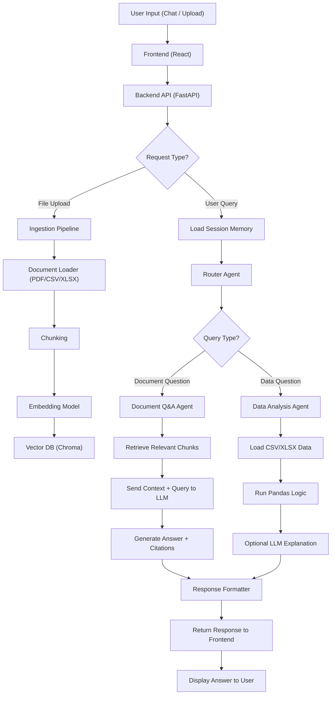

# ARCHITECTURE.md

## AI-Powered Project Intelligence Assistant

This system is a lightweight multi-agent RAG application built to ingest project documents (PDF, CSV, Excel), answer project-related questions with citations, and support follow-up questions within a session. The design prioritises simplicity, explainability, and end-to-end reliability over unnecessary complexity.

## 1. System Architecture

### Request Flow

1. Users upload project files from the frontend.
2. The backend parses each file, converts it into text, chunks it, embeds it using Gemini embeddings, and stores vectors in Chroma.
3. When a user asks a question, the frontend sends the question and `session_id` to FastAPI.
4. The backend retrieves recent chat history for that session.
5. Router logic selects the best agent: either Document Q&A or Data Analysis.
6. The selected agent retrieves relevant content from Chroma and sends context to the Gemini LLM.
7. The system returns the final answer, the agent used, and source citations.
8. The conversation is appended to session history for follow-up questions.

## 2. Technology Selection

### LLM: Gemini models

Gemini was selected as the primary LLM because it provides strong general reasoning, good instruction-following, and a matching embedding model within the same ecosystem. This keeps the stack simple and reduces integration overhead. For this assessment, that matters more than building a highly customised multi-provider architecture.

### Embeddings: Gemini Embedding

Gemini embeddings were chosen to keep semantic search aligned with the generation model. Using the same provider for embeddings and generation reduces compatibility issues and makes implementation faster. It is also a practical trade-off for a take-home project where speed of integration and reliability matter.

### Vector Database: Chroma

Chroma was chosen as the vector store because it is lightweight, easy to run locally, and works well for a prototype-scale RAG system. It avoids the setup overhead of a managed vector database while still supporting semantic retrieval, document metadata storage, and fast iteration. In this project, the vector data is stored in the local `my_vector_db` directory.

### Orchestration Framework: LangChain

LangChain was selected because the assessment explicitly requires Python with LangChain. It also fits the project well by providing a clean way to structure loaders, splitters, vector store integration, retrieval chains, and agent-like routing logic. The implementation stays modular and easier to explain during interview walkthroughs.

### Backend: FastAPI

FastAPI is used to expose REST endpoints for file upload and question answering. It is a strong fit for this architecture because it is lightweight, async-friendly, and easy to connect with a React frontend.

### Frontend: Next.js + React + TypeScript

Next.js with React and TypeScript was chosen for a modern frontend with a clean component structure. It supports the required user interactions well: file upload, chat UI, session-based conversation flow, and displaying which agent handled each question.

## 3. Data Pipeline Design

### Ingestion

The system supports three document types:

- PDF
- CSV
- Excel (`.xlsx`)

Uploaded files are sent from the frontend to the FastAPI backend, where loader logic extracts textual content. PDFs are treated as unstructured or semi-structured text documents. CSV and Excel files are treated as structured tabular sources, though they still pass through a shared indexing pipeline for retrieval.

### Chunking Strategy

After parsing, document text is split into smaller chunks before embedding and indexing.

**Design choice:** a recursive text splitter style approach is used because it is simple, reliable, and widely used in practical RAG systems. It preserves semantic coherence better than fixed hard splits and works across different file types.

**Why chunk at all?**

- Large raw documents exceed efficient retrieval size.
- Smaller chunks improve embedding quality and similarity matching.
- It reduces irrelevant context passed to the LLM.
- It makes citations more precise.

**Justification for this project:**
Project reports and risk documents often contain mixed sections such as status summaries, action items, milestones, cost comments, and risk notes. A chunked approach makes it more likely that retrieval returns the exact section relevant to the question instead of an entire long report.

**Practical assumption based on the build pattern:** chunking is likely implemented with a LangChain text splitter such as `RecursiveCharacterTextSplitter`, with moderate overlap to preserve continuity between neighbouring chunks. If asked in interview, this can be defended as the simplest strong baseline for messy business documents.

### Embedding and Indexing

Each chunk is embedded using the Gemini embedding model and stored in Chroma along with metadata such as source file name and chunk-level provenance. This allows the retriever to return semantically relevant chunks together with source references used in the final answer.

### Retrieval

At query time, the selected agent performs retrieval against Chroma to fetch the most relevant chunks. These chunks are then passed into the Gemini LLM as grounding context for answer generation.

## 4. Agent Orchestration

### Agents in the System

The implementation contains two specialised agents and an implicit routing layer:

1. **Document Q&A Agent**
   Handles narrative and report-style questions such as project status, milestones, delays, risks, and qualitative updates from PDFs or text-heavy documents.

2. **Data Analysis Agent**
   Handles questions better suited to structured or tabular data, such as budgets, totals, financial summaries, and spreadsheet-derived answers.

3. **Router Logic**
   Decides which agent should handle the incoming question.

### Routing Strategy

The router receives:

- current user query
- recent chat history from the same `session_id`

It then routes the question to the most appropriate agent. Based on the current project implementation, this appears to be a pragmatic router rather than a deeply nested agent graph, which is the right trade-off for a take-home assignment.

A reasonable interpretation of the current system is:

- document-style questions go to the Document Q&A agent
- numeric, financial, spreadsheet, or analysis-style questions go to the Data Analysis agent

This keeps separation of concerns clear and makes the system easy to explain and debug.

### Follow-up Queries / Session Memory

The backend accepts a `session_id` and retrieves recent chat history before routing the next question. This gives the system lightweight conversational memory and allows follow-up questions like “what about the budget for that same project?” without rebuilding a full long-term memory system.

This is a good engineering trade-off because:

- it improves usability
- it avoids stateless follow-up failures
- it stays simple enough for interview explanation

### Failure Handling

Failure handling is intentionally basic but practical:

- FastAPI catches exceptions and returns an HTTP 500 response when needed.
- If one agent path fails, the error can be surfaced clearly instead of silently hallucinating.
- Retrieval grounding reduces the chance of unsupported answers.
- The modular agent split makes debugging easier because routing and answer generation are separated.

For a future production version, failure handling could be improved with:

- fallback routing
- structured logging
- retrieval confidence thresholds
- better validation for unsupported file formats
- prompt injection filtering

## 5. Trade-off Summary

- local Chroma instead of a managed vector database
- two specialised agents instead of a large agent graph
- session-based recent history instead of complex memory infrastructure
- one LLM ecosystem for both embeddings and generation

---

## Assumptions noted

A few low-level implementation details were not explicitly confirmed from the available conversation history, so this document intentionally avoids inventing specifics such as exact chunk size, exact overlap, or exact routing heuristic. The design above is therefore written to match the implemented architecture pattern without overstating precision.
